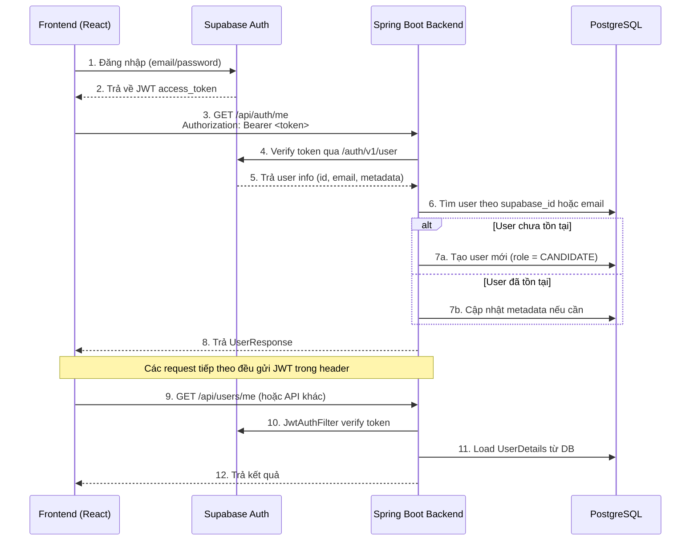

# 📖 ĐẶC TẢ DỰ ÁN — INTERN HIRING BACKEND

> **Phiên bản:** 1.1 · **Cập nhật:** 14/05/2026
> **Dành cho:** Intern mới tham gia dự án

---

## 1. Tổng quan dự án

**Intern Hiring Backend** là hệ thống REST API quản lý tuyển dụng thực tập sinh. Backend chịu trách nhiệm:

- Quản lý user (CRUD)
- Xác thực & phân quyền (Authentication & Authorization)
- Đồng bộ user từ Supabase Auth

### Tech Stack

| Thành phần | Công nghệ |
|---|---|
| Ngôn ngữ | Java 25 |
| Framework | Spring Boot 4.0.6 |
| Database | PostgreSQL (Supabase-hosted) |
| ORM | Spring Data JPA / Hibernate |
| Bảo mật | Spring Security + Supabase JWT |
| Build tool | Gradle |
| Thư viện hỗ trợ | Lombok, Jakarta Validation, JJWT 0.12.5 |

### Kiến trúc tổng thể

```
Client (React) ──► Supabase Auth (đăng nhập) ──► nhận JWT
       │
       ▼
  Spring Boot Backend
       │
  ┌────┴────┐
  │ JwtAuthFilter │  ◄── Verify token qua Supabase API
  └────┬────┘
       │
  Controller → Service → Repository → PostgreSQL (Supabase DB)
```

> [!IMPORTANT]
> Hệ thống **KHÔNG** tự quản lý đăng nhập/đăng ký. Frontend gọi Supabase Auth trực tiếp, nhận JWT, rồi gửi JWT đó trong header `Authorization: Bearer <token>` khi gọi API backend.

---

## 2. Cấu trúc thư mục (File Tree)

```
Intern_Hiring_Backend/
├── .env                          # Biến môi trường (KHÔNG đẩy lên Git)
├── .gitignore
├── build.gradle                  # Khai báo dependencies
├── settings.gradle
├── gradlew / gradlew.bat         # Gradle wrapper
│
└── src/
    ├── main/
    │   ├── java/com/internhiring/backend/
    │   │   ├── InternHiringApplication.java    # Entry point
    │   │   ├── config/
    │   │   │   ├── DataInitializer.java        # Tạo Admin trên Supabase Auth + DB local khi khởi động
    │   │   │   ├── SecurityConfig.java         # Cấu hình Spring Security + CORS
    │   │   │   └── SupabaseConfig.java         # Properties Supabase
    │   │   ├── controller/
    │   │   │   ├── AuthController.java         # API xác thực (/api/auth/**)
    │   │   │   └── UserController.java         # API quản lý user (/api/users/**)
    │   │   ├── dto/
    │   │   │   ├── UpdateRoleRequest.java      # DTO thay đổi role user
    │   │   │   ├── UpdateUserRequest.java      # DTO cập nhật thông tin user
    │   │   │   └── UserResponse.java           # DTO trả về cho client
    │   │   ├── entity/
    │   │   │   ├── Gender.java                 # Enum giới tính
    │   │   │   ├── Role.java                   # Enum vai trò
    │   │   │   └── User.java                   # Entity bảng users
    │   │   ├── exception/
    │   │   │   ├── GlobalExceptionHandler.java # Bắt lỗi tập trung
    │   │   │   ├── UserAlreadyExistsException.java
    │   │   │   └── UserNotFoundException.java
    │   │   ├── repository/
    │   │   │   └── UserRepository.java         # Data access layer
    │   │   ├── security/
    │   │   │   ├── CustomUserDetailsService.java # Load user cho Spring Security
    │   │   │   ├── JwksVerificationService.java  # Verify JWT qua Supabase API
    │   │   │   └── JwtAuthFilter.java            # Filter xác thực mỗi request
    │   │   └── service/
    │   │       ├── SupabaseUserSyncService.java  # Đồng bộ user Supabase → DB local
    │   │       └── UserService.java              # CRUD nghiệp vụ user
    │   │
    │   └── resources/
    │       └── application.yml                   # Cấu hình ứng dụng
    │
    └── test/
        └── java/com/internhiring/backend/
            └── InternHiringApplicationTests.java # Test cơ bản
```

---

## 3. Mô tả chi tiết từng file

### 3.1 Entry Point

#### `InternHiringApplication.java`
- **Package:** `com.internhiring.backend`
- **Vai trò:** Điểm khởi chạy ứng dụng Spring Boot. Chứa hàm `main()`.
- **Annotation:** `@SpringBootApplication` — tự động bật auto-configuration, component scan, và configuration.

---

### 3.2 Package `entity/` — Mô hình dữ liệu

#### `Gender.java` — Enum giới tính

```java
public enum Gender {
    MALE,       // Nam
    FEMALE,     // Nữ
    OTHER       // Khác
}
```

#### `Role.java` — Enum phân quyền

```java
public enum Role {
    ADMIN,      // Quản trị viên — toàn quyền
    CANDIDATE,  // Ứng viên thực tập
    RECRUITER   // Nhà tuyển dụng
}
```

#### `User.java` — Entity bảng `users`

| Trường | Kiểu | DB Column | Mô tả |
|---|---|---|---|
| `id` | `Long` | `id` (PK, auto-increment) | Khóa chính |
| `supabaseId` | `UUID` | `supabase_id` (unique) | ID từ Supabase Auth |
| `email` | `String` | `email` (unique, not null) | Email đăng nhập |
| `firstName` | `String` | `first_name` | Tên |
| `lastName` | `String` | `last_name` | Họ |
| `phoneNumber` | `String` | `phone_number` | Số điện thoại |
| `avatarUrl` | `String` | `avatar_url` | URL ảnh đại diện |
| `gender` | `Gender` | `gender` (STRING) | Giới tính |
| `dob` | `LocalDate` | `dob` | Ngày sinh |
| `cvUrl` | `String` | `cv_url` | URL file CV |
| `role` | `Role` | `role` (STRING) | Vai trò người dùng |
| `createdAt` | `LocalDateTime` | `created_at` | Tự động gán khi tạo |
| `updatedAt` | `LocalDateTime` | `updated_at` | Tự động cập nhật |
| `deleted` | `boolean` | `deleted` (default false) | Soft delete flag |

> [!NOTE]
> **Không có cột `password`** — mật khẩu hoàn toàn do Supabase Auth quản lý.

> [!NOTE]
> **Soft Delete:** Entity dùng `@SQLDelete` và `@SQLRestriction("deleted = false")`. Khi gọi `delete`, Hibernate chạy `UPDATE users SET deleted = true` thay vì `DELETE`. Các query tự động lọc bỏ record đã xóa.

---

### 3.3 Package `dto/` — Data Transfer Objects

#### `UpdateRoleRequest.java` — Dữ liệu thay đổi role

| Trường | Kiểu | Validation | Bắt buộc |
|---|---|---|---|
| `role` | `Role` | `@NotNull` | ✅ |

> Dùng bởi endpoint `PUT /api/users/{id}/role` (Admin only).

#### `UpdateUserRequest.java` — Dữ liệu cập nhật user

| Trường | Kiểu | Validation | Bắt buộc |
|---|---|---|---|
| `firstName` | `String` | `@Size(max=100)` | ❌ |
| `lastName` | `String` | `@Size(max=100)` | ❌ |
| `phoneNumber` | `String` | `@Size(max=20)` | ❌ |
| `avatarUrl` | `String` | `@Size(max=500)` | ❌ |
| `cvUrl` | `String` | `@Size(max=500)` | ❌ |
| `dob` | `LocalDate` | `@Past` | ❌ |
| `gender` | `Gender` | — | ❌ |

> Chỉ các trường **không null** trong request mới được cập nhật (partial update).

#### `UserResponse.java` — Dữ liệu trả về client

| Trường | Kiểu | Mô tả |
|---|---|---|
| `id` | `Long` | ID nội bộ |
| `email` | `String` | Email |
| `firstName` | `String` | Tên |
| `lastName` | `String` | Họ |
| `phoneNumber` | `String` | SĐT |
| `avatarUrl` | `String` | URL avatar |
| `cvUrl` | `String` | URL file CV |
| `gender` | `Gender` | Giới tính |
| `dob` | `LocalDate` | Ngày sinh |
| `role` | `Role` | Vai trò |
| `createdAt` | `LocalDateTime` | Ngày tạo |
| `updatedAt` | `LocalDateTime` | Ngày cập nhật |

> [!TIP]
> `UserResponse` **không chứa** `password` hay `supabaseId` → bảo vệ dữ liệu nhạy cảm.

---

### 3.4 Package `repository/`

#### `UserRepository.java`

Extends `JpaRepository<User, Long>`. Các method custom:

| Method | Return | Mô tả |
|---|---|---|
| `findByEmail(String email)` | `Optional<User>` | Tìm user theo email |
| `findBySupabaseId(UUID supabaseId)` | `Optional<User>` | Tìm user theo Supabase UUID |
| `existsByEmail(String email)` | `boolean` | Kiểm tra email đã tồn tại |

> Ngoài ra, thừa kế sẵn: `findById()`, `findAll()`, `save()`, `deleteById()`, `existsById()` từ JPA.

---

### 3.5 Package `service/` — Lớp nghiệp vụ

#### `UserService.java`

| Method | Input | Output | Mô tả |
|---|---|---|---|
| `getAllUsers()` | — | `List<UserResponse>` | Lấy tất cả user (đã map sang DTO) |
| `getUserById(Long id)` | id | `Optional<User>` | Tìm user theo ID |
| `getUserByEmail(String email)` | email | `Optional<User>` | Tìm user theo email |
| `getUserBySupabaseId(UUID)` | supabaseId | `Optional<User>` | Tìm user theo Supabase ID |
| `updateUser(Long id, UpdateUserRequest)` | id, request | `User` | Cập nhật partial (chỉ field != null) |
| `updateUserRole(Long id, Role)` | id, role | `User` | Thay đổi role user (Admin only) |
| `deleteUser(Long id)` | id | `void` | Soft delete, throw nếu không tìm thấy |
| `mapToUserResponse(User)` | user entity | `UserResponse` | Chuyển Entity → DTO |

#### `SupabaseUserSyncService.java`

| Method | Input | Output | Mô tả |
|---|---|---|---|
| `syncUserFromSupabase(Claims)` | JWT Claims | `User` | Đồng bộ user từ Supabase vào DB local |

**Logic đồng bộ (quan trọng — đọc kỹ):**

```
1. Tìm user theo supabaseId trong DB local
   ├── TÌM THẤY → Cập nhật các field null từ metadata → return
   └── KHÔNG TÌM THẤY
       ├── Tìm theo email
       │   ├── TÌM THẤY → Gắn supabaseId vào user hiện tại + cập nhật field null → return
       │   └── KHÔNG TÌM THẤY → Tạo user mới với role = CANDIDATE → return
```

> [!IMPORTANT]
> User mới được tạo qua sync **luôn có role = `CANDIDATE`**. Chỉ Admin mới có thể thay đổi role.

---

### 3.6 Package `security/` — Bảo mật

#### `JwksVerificationService.java` — Xác thực JWT

- **Cách hoạt động:** Gọi Supabase API endpoint `GET /auth/v1/user` với token trong header.
- Nếu Supabase trả về `2xx` → token hợp lệ → parse thông tin user (id, email, metadata).
- Tạo object `Claims` chứa: `sub` (supabase UUID), `email`, `firstName`, `lastName`, `phoneNumber`.

> [!WARNING]
> Service này gọi HTTP tới Supabase mỗi lần verify token. Điều này đảm bảo token chưa bị revoke nhưng tăng latency mỗi request.

#### `JwtAuthFilter.java` — Filter xác thực

Extends `OncePerRequestFilter`. Chạy trước mọi request:

```
1. Trích xuất JWT từ header "Authorization: Bearer <token>"
2. Gọi JwksVerificationService.verifyToken(jwt)
3. Load UserDetails từ DB:
   a. Thử tìm bằng supabase_id
   b. Fallback: tìm bằng email
4. Set Authentication vào SecurityContext
5. Chuyển request tiếp cho Controller
```

#### `CustomUserDetailsService.java`

| Method | Input | Mô tả |
|---|---|---|
| `loadUserByUsername(String email)` | email | Load user theo email → tạo `UserDetails` với `ROLE_<role>` |
| `loadUserBySupabaseId(String uuid)` | supabase UUID string | Load user theo Supabase ID → tạo `UserDetails` |

> Authority format: `ROLE_ADMIN`, `ROLE_CANDIDATE`, `ROLE_RECRUITER`

---

### 3.7 Package `config/`

#### `SecurityConfig.java`

| Cấu hình | Chi tiết |
|---|---|
| CSRF | **Tắt** (stateless API) |
| Session | **STATELESS** |
| Public endpoints | `/api/auth/**`, `/api/health` |
| Protected endpoints | Tất cả còn lại — yêu cầu JWT hợp lệ |
| CORS Origins | Đọc từ env, mặc định: `localhost:3000`, `localhost:5173` |
| CORS Methods | GET, POST, PUT, DELETE, OPTIONS |
| CORS Headers | Authorization, Content-Type, Accept |
| Password Encoder | BCrypt |
| Method Security | `@EnableMethodSecurity` → cho phép dùng `@PreAuthorize` |

#### `SupabaseConfig.java`

Đọc config từ prefix `supabase.*` trong `application.yml`:

| Property | Mô tả |
|---|---|
| `projectRef` | Supabase project reference ID |
| `anonKey` | Anon/public key |
| `serviceRoleKey` | Service role key (admin) |
| `jwksUri` | URL lấy JWKS |
| `getProjectUrl()` | Trả về `https://<projectRef>.supabase.co` |

#### `DataInitializer.java`

- Implements `CommandLineRunner` → chạy khi app khởi động.
- Admin mặc định: `admin@intern_hiring.com` / `123456789` (hardcoded).
- Kiểm tra email admin đã tồn tại trong DB local chưa.
- Nếu chưa → gọi **Supabase Admin API** (`POST /auth/v1/admin/users` với `service_role_key`) để tạo user trên Supabase Auth với `email_confirm: true` (bypass email verification).
- Lấy `supabaseId` từ response → tạo user local với `Role.ADMIN`.
- Handle edge case: nếu Supabase trả 422 (email đã tồn tại trên Supabase) → fetch lại user để lấy UUID → tạo local.
- Nếu thất bại → log warning, app vẫn khởi động bình thường.

---

### 3.8 Package `exception/`

#### `GlobalExceptionHandler.java` — `@ControllerAdvice`

| Exception | HTTP Status | Response format |
|---|---|---|
| `UserAlreadyExistsException` | `400 Bad Request` | `{"error": "Bad Request", "message": "..."}` |
| `UserNotFoundException` | `404 Not Found` | `{"error": "Not Found", "message": "..."}` |
| `MethodArgumentNotValidException` | `400 Bad Request` | `{"error": "Validation Failed", "details": {"field": "msg"}}` |
| `Exception` (catch-all) | `500 Internal Server Error` | `{"error": "Internal Server Error", "message": "An unexpected error..."}` |

> [!TIP]
> Mọi lỗi đều trả về JSON format thống nhất. Frontend luôn parse được cấu trúc `{ error, message }` hoặc `{ error, details }`.

---

## 4. Danh sách API Endpoints

### 4.1 Auth APIs — `AuthController`

Base path: `/api/auth`

---

#### `GET /api/auth/me` — Lấy thông tin user hiện tại (từ token)

- **Quyền:** Public (nhưng cần gửi JWT hợp lệ trong header)
- **Mục đích:** Frontend gọi sau khi user đăng nhập Supabase để lấy profile từ backend. Nếu user chưa tồn tại trong DB local → tự động tạo mới.

**Request:**
```http
GET /api/auth/me
Authorization: Bearer <supabase_jwt_token>
```

**Response thành công — `200 OK`:**
```json
{
  "id": 1,
  "email": "user@example.com",
  "firstName": "Nguyen",
  "lastName": "Van A",
  "phoneNumber": "0912345678",
  "avatarUrl": null,
  "cvUrl": null,
  "gender": null,
  "dob": null,
  "role": "CANDIDATE",
  "createdAt": "2026-05-10T10:30:00",
  "updatedAt": "2026-05-10T10:30:00"
}
```

**Response lỗi — `401 Unauthorized`:**
```json
{ "error": "Invalid token" }
```

---

### 4.2 User APIs — `UserController`

Base path: `/api/users`

> [!IMPORTANT]
> Tất cả endpoint trong `UserController` đều yêu cầu JWT hợp lệ trong header `Authorization`. Các endpoint có `@PreAuthorize("hasRole('ADMIN')")` chỉ Admin mới gọi được.

---

#### `GET /api/users` — Lấy danh sách tất cả user

- **Quyền:** 🔒 `ADMIN` only
- **Response:** `200 OK` — `List<UserResponse>`

```json
[
  {
    "id": 1,
    "email": "admin@intern_hiring.com",
    "firstName": "System",
    "lastName": "Admin",
    "phoneNumber": "0123456789",
    "avatarUrl": null,
    "cvUrl": null,
    "gender": null,
    "dob": null,
    "role": "ADMIN",
    "createdAt": "2026-05-01T08:00:00",
    "updatedAt": "2026-05-01T08:00:00"
  },
  {
    "id": 2,
    "email": "candidate@gmail.com",
    "firstName": "Tran",
    "lastName": "Thi B",
    "phoneNumber": null,
    "avatarUrl": null,
    "cvUrl": "https://example.com/cv.pdf",
    "gender": "FEMALE",
    "dob": "2003-06-15",
    "role": "CANDIDATE",
    "createdAt": "2026-05-10T14:00:00",
    "updatedAt": "2026-05-10T14:00:00"
  }
]
```

---

#### `GET /api/users/{id}` — Lấy user theo ID

- **Quyền:** 🔒 `ADMIN` only
- **Path param:** `id` (Long)
- **Response:** `200 OK` — `UserResponse`
- **Lỗi:** `404` nếu không tìm thấy

---

#### `GET /api/users/me` — Lấy profile user đang đăng nhập

- **Quyền:** 🔓 Mọi user đã đăng nhập
- **Response:** `200 OK` — `UserResponse`
- **Lỗi:** `404` nếu user không tồn tại trong DB

---

#### `PUT /api/users/me` — Cập nhật profile cá nhân

- **Quyền:** 🔓 Mọi user đã đăng nhập
- **Request Body:** `UpdateUserRequest`

```json
{
  "firstName": "Nguyen Updated",
  "lastName": "Van B",
  "phoneNumber": "0987654321",
  "avatarUrl": "https://example.com/avatar.jpg",
  "cvUrl": "https://example.com/cv.pdf",
  "dob": "2003-06-15",
  "gender": "MALE"
}
```

- **Response:** `200 OK` — `UserResponse` (đã cập nhật)
- **Lỗi:** `400` nếu validation fail, `404` nếu user không tìm thấy

---

#### `PUT /api/users/{id}` — Admin cập nhật user bất kỳ

- **Quyền:** 🔒 `ADMIN` only
- **Path param:** `id` (Long)
- **Request Body:** `UpdateUserRequest` (giống trên)
- **Response:** `200 OK` — `UserResponse`
- **Lỗi:** `400` validation, `404` not found

---

#### `DELETE /api/users/{id}` — Xóa user (soft delete)

- **Quyền:** 🔒 `ADMIN` only
- **Path param:** `id` (Long)
- **Response:** `204 No Content`
- **Lỗi:** `404` nếu không tìm thấy

> [!NOTE]
> Đây là **soft delete** — record không bị xóa khỏi DB mà chỉ set `deleted = true`. Các query sau đó tự động bỏ qua record này.

---

---

#### `PUT /api/users/{id}/role` — Thay đổi role user

- **Quyền:** 🔒 `ADMIN` only
- **Path param:** `id` (Long)
- **Request Body:** `UpdateRoleRequest`

```json
{
  "role": "ADMIN"
}
```

- **Response:** `200 OK` — `UserResponse` (đã cập nhật role)
- **Lỗi:** `404` nếu không tìm thấy

> [!TIP]
> Dùng endpoint này để promote user lên ADMIN hoặc đổi role. Hỗ trợ nhiều admin.

---

### 4.3 Tổng hợp API

| Method | Endpoint | Quyền | Mô tả |
|---|---|---|---|
| `GET` | `/api/auth/me` | Public* | Lấy/tạo profile từ JWT |
| `GET` | `/api/users` | ADMIN | Danh sách tất cả user |
| `GET` | `/api/users/{id}` | ADMIN | Lấy user theo ID |
| `GET` | `/api/users/me` | Authenticated | Profile cá nhân |
| `PUT` | `/api/users/me` | Authenticated | Cập nhật profile |
| `PUT` | `/api/users/{id}` | ADMIN | Admin cập nhật user |
| `PUT` | `/api/users/{id}/role` | ADMIN | Thay đổi role user |
| `DELETE` | `/api/users/{id}` | ADMIN | Soft delete user |

> *Public nhưng yêu cầu JWT Supabase hợp lệ trong header.

---

## 5. Luồng xác thực (Authentication Flow)



---

## 6. Cấu hình Environment

### File `.env` (tạo ở thư mục gốc dự án)

```properties
# Database
DB_URL=jdbc:postgresql://<host>:<port>/<database>?prepareThreshold=0
DB_USERNAME=<db_username>
DB_PASSWORD=<db_password>

# Server
SERVER_PORT=8080

# CORS
CORS_ORIGINS=http://localhost:3000,http://localhost:5173

# Supabase
SUPABASE_PROJECT_ID=<your_project_ref>
SUPABASE_ANON=<anon_key>
SUPABASE_SERVICE_ROLE=<service_role_key>
```

> [!NOTE]
> **Không cần** `ADMIN_EMAIL`, `ADMIN_PASSWORD`, `JWT_SECRET`, `JWT_EXPIRATION` nữa.
> Admin mặc định (`admin@intern_hiring.com` / `123456789`) được hardcoded trong `DataInitializer`.
> Tài khoản admin được tạo trên Supabase Auth qua Admin API khi app khởi động.

> [!CAUTION]
> File `.env` chứa thông tin nhạy cảm (mật khẩu DB, API keys). **TUYỆT ĐỐI KHÔNG** commit lên Git. File này đã được thêm trong `.gitignore`.

### `application.yml` — Profile

| Profile | Database | Dùng khi |
|---|---|---|
| `default` | PostgreSQL (Supabase) | Chạy thật |
| `test` | H2 in-memory | Chạy unit test |

---

## 7. Hướng dẫn chạy dự án

### Yêu cầu

- JDK 25+
- File `.env` đã được cấu hình (xin từ leader)

### Các lệnh

```bash
# Build dự án (kiểm tra lỗi compile)
./gradlew build

# Chạy server (auto-reload khi thay đổi code)
./gradlew bootRun -t

# Chạy test
./gradlew test
```

Server khởi chạy tại: `http://localhost:8080`

---

## 8. Quy tắc code cho Intern

### Luồng dữ liệu bắt buộc

```
Client Request → Controller → Service → Repository → Database
                     ↓              ↓
               Dùng DTO        Dùng Entity
              (request/response)  (nội bộ)
```

### Quy tắc quan trọng

1. **Controller** chỉ nhận request và trả response. **KHÔNG** viết logic nghiệp vụ ở đây.
2. **Service** chứa toàn bộ business logic: validate, transform, gọi repository.
3. **Repository** chỉ tương tác với DB. Không có logic.
4. **Luôn dùng DTO** khi giao tiếp với client. Không bao giờ trả trực tiếp Entity ra ngoài.
5. **Phân quyền** bằng `@PreAuthorize("hasRole('ADMIN')")` trên method controller.
6. **Validation** bằng Jakarta Validation annotation (`@NotBlank`, `@Size`, `@Email`) trên DTO + `@Valid` trên controller parameter.
7. **Exception** tự định nghĩa, throw từ Service, catch tập trung ở `GlobalExceptionHandler`.

---

## 9. Dependencies chính (`build.gradle`)

| Dependency | Mục đích |
|---|---|
| `spring-boot-starter-web` | REST API framework |
| `spring-boot-starter-data-jpa` | ORM + Repository pattern |
| `spring-boot-starter-validation` | Jakarta Bean Validation |
| `spring-boot-starter-security` | Authentication & Authorization |
| `jackson-databind` | JSON serialization/deserialization |
| `postgresql` | PostgreSQL JDBC driver |
| `h2` | In-memory DB cho test |
| `lombok` | Giảm boilerplate (getter/setter/constructor) |
| `jjwt-api/impl/jackson` | JWT parsing & Claims builder |
| `spring-boot-devtools` | Auto-restart khi code thay đổi |
